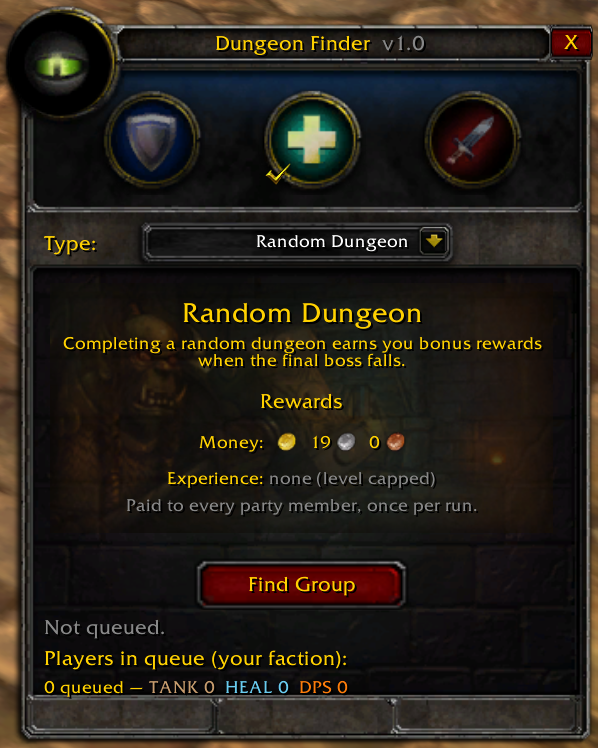
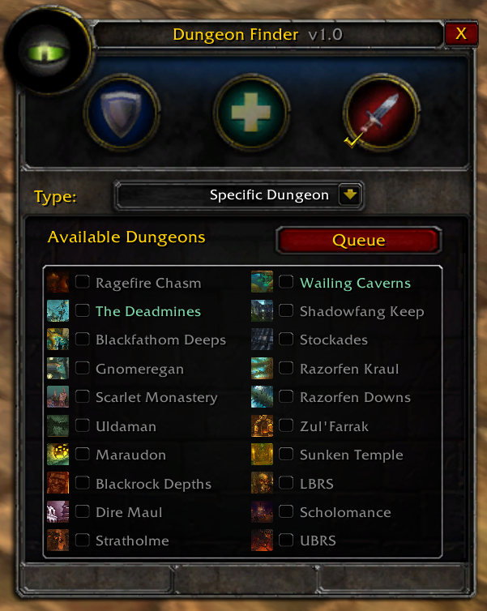

# LushwaterLFG

Random Dungeon Finder + LFG addon for **World of Warcraft 1.12.1** (vanilla),
built for the Lushwater server. Uses only the stock 1.12 Lua/UI API — no client
patches required.

Matchmaking is decentralized over a hidden custom chat channel (`LushLFG`),
with server-side teleport, summon, and completion-reward support provided by
the Lushwater mangosd RDF module (`src/mangos-classic/src/game/Custom/Rdf.cpp`).

Design reference: [LFT (Looking For Turtles)](https://github.com/BobSemple/LFT).
LFT itself is not portable to stock 1.12.1 (it uses `SendAddonMessage`, added
in 2.0); this addon rewrites the comms layer around the 1.12-native hidden chat
channel pattern.

## Features

- **Random Dungeon Finder** — queue as Tank, Healer, and/or DPS; the matcher
  builds 1/1/3 parties for a random dungeon appropriate to your level and the
  server's current phase.
- **Ready check** — Popup with a live status strip showing each
  member's role and waiting/ready/declined state.
- **Specific Dungeon LFG** — pick individual dungeons and broadcast to same-faction
  players.
- **Server teleport** — when a random group forms each party member is teleported into
  the dungeon automatically; members can teleport out and back in while the group is
  active.
- **Completion rewards** — bonus XP and money paid once per run when the final
  boss dies.
- **Replacement queueing** — if a member leaves or is kicked mid-run, the leader
  automatically re-queues for a replacement.
- **Minimap eye button** — opens the window, animates while queued, and can be
  dragged around the minimap edge (position saved).
- **Same-faction only** — every protocol message carries the sender's faction
  tag; the server also rejects cross-faction invites.

## Install

Copy the `LushwaterLFG/` folder into `Interface/AddOns/` of a 1.12.1 client and
enable it on the character-select addon screen. Folder name must be exactly
`LushwaterLFG`.

Optional: run `./fetch-lft-art.sh` to download LFT textures into `images/` if they are
missing. The `images/` folder is included in this repository.

## Usage

- `/lwlfg` — toggle the Dungeon Finder window.
- **Random tab** — choose your role(s), click **Find Group**.
- **Specific tab** — choose your role and the dungeons you want, click **Queue**.
- Click the minimap eye button to open the window; drag it to move.

## Screenshots

### Random Dungeon tab



### Specific Dungeon tab



## Protocol

All peer-to-peer traffic runs on the hidden channel `LushLFG`:

```
LW:LFG:<faction>:<level>:<class>:<role>:<d1,d2>      specific-queue announce
LW:LEAVE                                            leave specific queue
LW:PING                                             request re-broadcast on join
LW:RQ:<faction>:<level>:<class>:<role1,role2>       random-queue announce
LW:RQLEAVE                                          leave random queue
LW:PROP:<propId>:<dungeon>:<n1=role>,<n2=role>,...  match proposal
LW:READY:<propId>:<ACCEPT|DECLINE>                  ready-check response
LW:FORM:<propId>:<leaderName>                       instruct leader to invite
LW:NEED:<faction>:<dungeon>:<role1,role2>           replacement request
LW:NEEDSTOP                                         replacement request closed
LW:RPROP:<propId>:<leader>:<dungeon>:<name=role>  replacement proposal
LW:RREADY:<propId>:<ACCEPT|DECLINE>                replacement ready-check
```

Server bot traffic whispers to/from the player `LushLFG`:

```
SUMMON:<dungeonKey>     leader: validate and teleport the party into the dungeon
TELEPORT_OUT            port back to the saved pre-summon location
TELEPORT_IN             port back into the dungeon
JOIN                    replacement member: record and teleport to the entrance
ELIGIBLE                request level/phase eligibility and reward preview
```

Replies: `SUMMON_OK`, `SUMMON_FAIL:<reason>`, `PORT_OUT_OK`, `PORT_IN_OK`,
`PORT_FAIL:<reason>`, `JOIN_OK:<key>:<name>`, `REWARD:<key>:<xp>:<copper>`,
`REWARDINFO:<xp>:<copper>`, `RANGES:<key>=<lo>-<hi>,...`, `UNAVAILABLE`.

See `docs/lushwater/PartII_RdfTeleports.md` and `Rdf_Security_Audit.md` for the
server side and security posture.

## Known limitations

- **Ghost matcher:** if the elected matcher's client crashes without sending
  `RQLEAVE`, matching stalls until their pool entry expires (≤200 s).
- **Server teleports are in-memory**: after a mangosd restart, saved teleport-out
  locations are gone — players inside walk out or hearth.
- Match quality is greedy/backtracking on offered roles and level ranges only —
  no gear/spec awareness (not available in the 1.12 API).
- The chat channel is public-by-name; malicious clients could spam the protocol.
  Basic validation is in place (matcher-name check on `PROP`/`FORM`), and server
  rate limits (`NetworkFlood.PacketRate`) provide a backstop.
